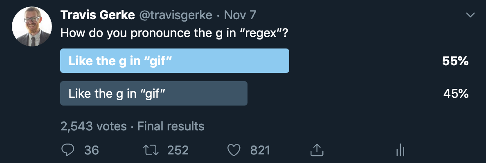

---
output:
  html_document:
    code_folding: hide
---

```{r setup, include=FALSE}
library(tidyverse)

knitr::opts_chunk$set(
  echo = FALSE, cache = FALSE,
  warning = FALSE, message = FALSE,
  fig.width = 10, fig.height = 7, 
  fig.retina = 2,
  fig.showtext = TRUE # for the fancy fonts, disable if not needed
)
# Use the grkmisc theme
theme_set(
  grkmisc::theme_grk(
    base_family = "Source Serif Pro",
    axis_text_family = "Source Code Pro",
    axis_title_family = "Source Serif Pro",
    default_geom_font = "Source Sans Pro",
    use_showtext = TRUE
  ) + 
    theme(panel.grid.minor = element_blank())
)
```
  
### Analysis: How do you pronounce regex?

[](https://twitter.com/travisgerke/status/1192432767881162754)


```{r echo=TRUE}
result <- round(2543*.55) %>%
  binom.test(2543) %>%
  broom::tidy() 

gt::gt(result)
```

```{r echo=FALSE}
result %>% 
  ggplot(aes(x=0, y=estimate)) + 
  geom_point() + 
  geom_errorbar(aes(ymin=conf.low, ymax=conf.high, width=.1)) + 
  geom_hline(yintercept=.5, color="darkblue", linetype="dashed") + 
  xlim(-.2, .2) + 
  ylim(.4, .6) + 
  ylab("P(Like the g in gif)") + 
  theme(axis.title.x = element_blank(),
        axis.text.x = element_blank(),
        axis.ticks.x = element_blank())
```