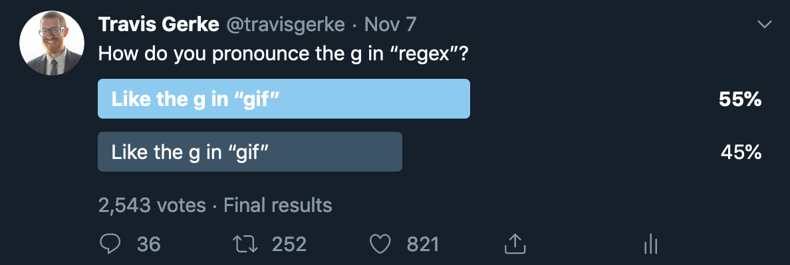

### Analysis: How do you pronounce regex?

[](https://twitter.com/travisgerke/status/1192432767881162754)

``` r
result <- round(2543*.55) %>%
  binom.test(2543) %>%
  broom::tidy() 

gt::gt(result)
```

<!--html_preserve-->

<style>html {
  font-family: -apple-system, BlinkMacSystemFont, 'Segoe UI', Roboto, Oxygen, Ubuntu, Cantarell, 'Helvetica Neue', 'Fira Sans', 'Droid Sans', Arial, sans-serif;
}

#vskjgwpqfi .gt_table {
  display: table;
  border-collapse: collapse;
  margin-left: auto;
  margin-right: auto;
  color: #333333;
  font-size: 16px;
  background-color: #FFFFFF;
  /* table.background.color */
  width: auto;
  /* table.width */
  border-top-style: solid;
  /* table.border.top.style */
  border-top-width: 2px;
  /* table.border.top.width */
  border-top-color: #A8A8A8;
  /* table.border.top.color */
  border-bottom-style: solid;
  /* table.border.bottom.style */
  border-bottom-width: 2px;
  /* table.border.bottom.width */
  border-bottom-color: #A8A8A8;
  /* table.border.bottom.color */
}

#vskjgwpqfi .gt_heading {
  background-color: #FFFFFF;
  /* heading.background.color */
  border-bottom-color: #FFFFFF;
}

#vskjgwpqfi .gt_title {
  color: #333333;
  font-size: 125%;
  /* heading.title.font.size */
  padding-top: 4px;
  /* heading.top.padding - not yet used */
  padding-bottom: 4px;
  border-bottom-color: #FFFFFF;
  border-bottom-width: 0;
}

#vskjgwpqfi .gt_subtitle {
  color: #333333;
  font-size: 85%;
  /* heading.subtitle.font.size */
  padding-top: 0;
  padding-bottom: 4px;
  /* heading.bottom.padding - not yet used */
  border-top-color: #FFFFFF;
  border-top-width: 0;
}

#vskjgwpqfi .gt_bottom_border {
  border-bottom-style: solid;
  /* heading.border.bottom.style */
  border-bottom-width: 2px;
  /* heading.border.bottom.width */
  border-bottom-color: #D3D3D3;
  /* heading.border.bottom.color */
}

#vskjgwpqfi .gt_column_spanner {
  border-bottom-style: solid;
  border-bottom-width: 2px;
  border-bottom-color: #D3D3D3;
  padding-top: 4px;
  padding-bottom: 4px;
}

#vskjgwpqfi .gt_col_heading {
  color: #333333;
  background-color: #FFFFFF;
  /* column_labels.background.color */
  font-size: 16px;
  /* column_labels.font.size */
  font-weight: initial;
  /* column_labels.font.weight */
  vertical-align: middle;
  padding: 5px;
  margin: 10px;
  overflow-x: hidden;
}

#vskjgwpqfi .gt_columns_top_border {
  border-top-style: solid;
  border-top-width: 2px;
  border-top-color: #D3D3D3;
}

#vskjgwpqfi .gt_columns_bottom_border {
  border-bottom-style: solid;
  border-bottom-width: 2px;
  border-bottom-color: #D3D3D3;
}

#vskjgwpqfi .gt_sep_right {
  border-right: 5px solid #FFFFFF;
}

#vskjgwpqfi .gt_group_heading {
  padding: 8px;
  /* row_group.padding */
  color: #333333;
  background-color: #FFFFFF;
  /* row_group.background.color */
  font-size: 16px;
  /* row_group.font.size */
  font-weight: initial;
  /* row_group.font.weight */
  border-top-style: solid;
  /* row_group.border.top.style */
  border-top-width: 2px;
  /* row_group.border.top.width */
  border-top-color: #D3D3D3;
  /* row_group.border.top.color */
  border-bottom-style: solid;
  /* row_group.border.bottom.style */
  border-bottom-width: 2px;
  /* row_group.border.bottom.width */
  border-bottom-color: #D3D3D3;
  /* row_group.border.bottom.color */
  vertical-align: middle;
}

#vskjgwpqfi .gt_empty_group_heading {
  padding: 0.5px;
  color: #333333;
  background-color: #FFFFFF;
  /* row_group.background.color */
  font-size: 16px;
  /* row_group.font.size */
  font-weight: initial;
  /* row_group.font.weight */
  border-top-style: solid;
  /* row_group.border.top.style */
  border-top-width: 2px;
  /* row_group.border.top.width */
  border-top-color: #D3D3D3;
  /* row_group.border.top.color */
  border-bottom-style: solid;
  /* row_group.border.bottom.style */
  border-bottom-width: 2px;
  /* row_group.border.bottom.width */
  border-bottom-color: #D3D3D3;
  /* row_group.border.bottom.color */
  vertical-align: middle;
}

#vskjgwpqfi .gt_striped {
  background-color: #8080800D;
}

#vskjgwpqfi .gt_from_md > :first-child {
  margin-top: 0;
}

#vskjgwpqfi .gt_from_md > :last-child {
  margin-bottom: 0;
}

#vskjgwpqfi .gt_row {
  padding: 8px;
  /* row.padding */
  margin: 10px;
  border-top-style: solid;
  border-top-width: 1px;
  border-top-color: #D3D3D3;
  vertical-align: middle;
  overflow-x: hidden;
}

#vskjgwpqfi .gt_stub {
  border-right-style: solid;
  border-right-width: 2px;
  border-right-color: #D3D3D3;
  padding-left: 12px;
}

#vskjgwpqfi .gt_summary_row {
  color: #333333;
  background-color: #FFFFFF;
  /* summary_row.background.color */
  padding: 8px;
  /* summary_row.padding */
  text-transform: inherit;
  /* summary_row.text_transform */
}

#vskjgwpqfi .gt_grand_summary_row {
  color: #333333;
  background-color: #FFFFFF;
  /* grand_summary_row.background.color */
  padding: 8px;
  /* grand_summary_row.padding */
  text-transform: inherit;
  /* grand_summary_row.text_transform */
}

#vskjgwpqfi .gt_first_summary_row {
  border-top-style: solid;
  border-top-width: 2px;
  border-top-color: #D3D3D3;
}

#vskjgwpqfi .gt_first_grand_summary_row {
  border-top-style: double;
  border-top-width: 6px;
  border-top-color: #D3D3D3;
}

#vskjgwpqfi .gt_table_body {
  border-top-style: solid;
  /* table_body.border.top.style */
  border-top-width: 2px;
  /* table_body.border.top.width */
  border-top-color: #D3D3D3;
  /* table_body.border.top.color */
  border-bottom-style: solid;
  /* table_body.border.bottom.style */
  border-bottom-width: 2px;
  /* table_body.border.bottom.width */
  border-bottom-color: #D3D3D3;
  /* table_body.border.bottom.color */
}

#vskjgwpqfi .gt_footnotes {
  border-top-style: solid;
  /* footnotes.border.top.style */
  border-top-width: 2px;
  /* footnotes.border.top.width */
  border-top-color: #D3D3D3;
  /* footnotes.border.top.color */
}

#vskjgwpqfi .gt_footnote {
  font-size: 90%;
  /* footnote.font.size */
  margin: 0px;
  padding: 4px;
  /* footnote.padding */
}

#vskjgwpqfi .gt_sourcenotes {
  border-top-style: solid;
  /* sourcenotes.border.top.style */
  border-top-width: 2px;
  /* sourcenotes.border.top.width */
  border-top-color: #D3D3D3;
  /* sourcenotes.border.top.color */
}

#vskjgwpqfi .gt_sourcenote {
  font-size: 90%;
  /* sourcenote.font.size */
  padding: 4px;
  /* sourcenote.padding */
}

#vskjgwpqfi .gt_center {
  text-align: center;
}

#vskjgwpqfi .gt_left {
  text-align: left;
}

#vskjgwpqfi .gt_right {
  text-align: right;
  font-variant-numeric: tabular-nums;
}

#vskjgwpqfi .gt_font_normal {
  font-weight: normal;
}

#vskjgwpqfi .gt_font_bold {
  font-weight: bold;
}

#vskjgwpqfi .gt_font_italic {
  font-style: italic;
}

#vskjgwpqfi .gt_super {
  font-size: 65%;
}

#vskjgwpqfi .gt_footnote_marks {
  font-style: italic;
  font-size: 65%;
}
</style>

<div id="vskjgwpqfi" style="overflow-x:auto;overflow-y:auto;width:auto;height:auto;">

<table class="gt_table">

<tr>

<th class="gt_col_heading gt_columns_bottom_border gt_columns_top_border gt_center" rowspan="1" colspan="1">

estimate

</th>

<th class="gt_col_heading gt_columns_bottom_border gt_columns_top_border gt_center" rowspan="1" colspan="1">

statistic

</th>

<th class="gt_col_heading gt_columns_bottom_border gt_columns_top_border gt_center" rowspan="1" colspan="1">

p.value

</th>

<th class="gt_col_heading gt_columns_bottom_border gt_columns_top_border gt_center" rowspan="1" colspan="1">

parameter

</th>

<th class="gt_col_heading gt_columns_bottom_border gt_columns_top_border gt_center" rowspan="1" colspan="1">

conf.low

</th>

<th class="gt_col_heading gt_columns_bottom_border gt_columns_top_border gt_center" rowspan="1" colspan="1">

conf.high

</th>

<th class="gt_col_heading gt_columns_bottom_border gt_columns_top_border gt_left" rowspan="1" colspan="1">

method

</th>

<th class="gt_col_heading gt_columns_bottom_border gt_columns_top_border gt_left" rowspan="1" colspan="1">

alternative

</th>

</tr>

<body class="gt_table_body">

<tr>

<td class="gt_row gt_right">

0.5501376

</td>

<td class="gt_row gt_right">

1399

</td>

<td class="gt_row gt_right">

4.633364e-07

</td>

<td class="gt_row gt_right">

2543

</td>

<td class="gt_row gt_right">

0.5305573

</td>

<td class="gt_row gt_right">

0.5696024

</td>

<td class="gt_row gt_left">

Exact binomial test

</td>

<td class="gt_row gt_left">

two.sided

</td>

</tr>

</body>

</table>

</div>

<!--/html_preserve-->


